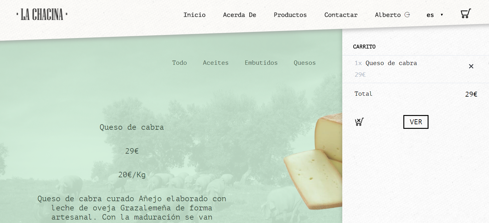

# Proyecto Desarrollo de Aplicaciones Web

## Tienda Online con Administración de venta de  productos Ibéricos

### Tecnologias usadas Back-End: Node Express EcmaScript6 bcrypt-nodejs MongoDB nodemon API Gulp

### Tecnologias usadas Frond-End: Html5 Css Bootstrap Javascript Jquery Ajax Sass handlebarsjs

ScreenShots de la tienda Online:

[VER PROYECTO](https://project-daw.herokuapp.com/es/)

[VER PROYECTO](https://project-daw.herokuapp.com/es/)

[VER PROYECTO](https://project-daw.herokuapp.com/es/)

[VER PROYECTO](https://project-daw.herokuapp.com/es/)
